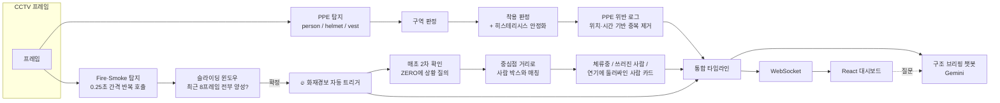

# SAIV — SafeAIVision

**RGB CCTV 하나로 평상시엔 안전사고를 예방하고, 화재가 나면 대피 이행까지 끝까지 확인하는 산업안전 비전 시스템.**

2026 SuperB AI × BDAI 해커톤(산업안전·물류 트랙) 출품작 — 팀 **노곤노곤**.

**🔗 라이브 데모: [lastsight-ai.onrender.com](https://lastsight-ai.onrender.com)**
> Render 무료 플랜이라 접속 후 첫 응답까지 최대 1분 정도 걸릴 수 있습니다(콜드 스타트). 접속 후 우측 상단 "시나리오 시작"을 누르면 평상시 → 화재감지 → 경보 자동 트리거 → 매초 2차 확인 → 구조 브리핑 챗봇 순으로 데모가 재생됩니다.

---

## 왜 만들었나

CCTV 화재 신호가 켜진 뒤가 문제다. 관제 담당자는 "지금 저 안에 몇 명이 있고, 그중 위험해 보이는 사람이 있는지"를 확인할 방법이 없다 — 화면을 계속 노려보거나, 소방대가 도착할 때까지 기다리는 것 말고는. SAIV는 화재/연기를 자동으로 감지해 경보를 울린 다음, **경보가 뜬 순간부터 매초** 그 프레임을 다시 확인해 "체류중 / 쓰러진 사람 / 연기에 둘러싸인 사람" 카드를 시간순으로 쌓아준다. 화재가 없는 평상시에는 같은 카메라로 안전모·조끼 미착용을 상시 감지해 사고를 예방한다.

## 핵심 기능

- **평상시 → 비상시 자동 전환 대시보드**: 한 화면 안에서 PPE 준수율·구역별 인원(평상시)과 현재 관측 인원·화재경보 배너(비상시)가 자동으로 전환된다.
- **화재 후 매초 2차 확인 (핵심 차별점)**: 화재경보가 뜨는 순간부터 매초 그 프레임을 다시 확인해 우려 신호를 카드로 쌓는다. 개인별 재식별을 하지 않는 시스템 설계상, 화면을 벗어난 사람을 "안전" 또는 "위험" 어느 쪽으로도 확정하지 않는다 — 모든 카드에 "추정 정보 — 확정 아님"이 항상 붙는다.
- **PPE 상시 감지**: 추적 없이 위치·시간 기반으로 중복 없이 위반을 기록하고, 증거 사진과 함께 관리자가 카드를 열어 직접 정정할 수 있다(원판정은 감사 기록으로 유지).
- **구역(Zone) 편집 UI**: 관리자가 카메라 화면 위에 폴리곤을 직접 그리고 이름을 붙인다.
- **통합 타임라인**: 평상시 PPE 이력 + 화재 발생 + 2차 확인 카드를 하나의 시간축에 표시하고, 위치 매칭이 갈라놓은 중복 기록은 드래그로 병합한다.
- **구조 브리핑 챗봇**: 지금까지 기록된 모든 데이터(+시간 힌트가 있으면 그 시점 프레임)를 근거로 Gemini가 자유 질문에 답한다. "전원 안전" 같은 확정 선언은 시스템 프롬프트 수준에서 금지된다.

### 안전 설계 원칙

이 프로젝트의 기술적 차별점보다 더 중요하게 여긴 것은 아래 원칙이다 — 기능 하나하나가 이 원칙을 어기지 않는지 검증하며 만들었다.

- 관측이 끊겼다고 "대피 완료"로, 계속 관측된다고 "위험 확정"으로 간주하지 않는다.
- 얼굴인식·사번 매칭·신원 특정을 하지 않는다. 사람은 매 순간 새로 매기는 임시 ID로만 다룬다.
- 동일 복장을 동일인으로 병합하지 않는다.
- 공장 전체 재실 인원을 확정하지 않는다 — "CCTV 관측 범위 내 분류"라는 표현을 유지한다.
- AI 단독으로 "전원 대피 완료"를 선언하는 화면·로직을 두지 않는다(False All-Clear 방지를 최우선 안전 지표로 취급).

## 아키텍처



탐지는 BDAI 파운데이션 모델(ZERO)에 텍스트 프롬프트로 질의하는 방식을 기본값으로 쓴다. PPE·Fire/Smoke 각각 커스텀 모델도 직접 학습시켰지만, 아래처럼 실측 비교 후 서비스 기본값은 ZERO로 확정했다.

## 모델 실험 — 그리고 왜 결국 ZERO를 채택했나

검증 지표만 보면 커스텀 학습 모델이 준수했다. 하지만 데모 영상으로 ZERO와 직접 비교 실측하자 결과가 뒤집혔다.

| 모델 | 실험 | 검증 mAP | mAP@50 | Precision | Recall |
|---|---|---|---|---|---|
| PPE (RF-DETR Large) | 6차 — 데이터 29,005장 대량 확장 | 0.579 | 0.837 | 0.886 | 0.838 |
| Fire/Smoke (RF-DETR Nano) | 4차 — segmentation→detection 태스크 전환 | 0.587 | 0.891 | 0.907 | 0.887 |

실사용 비교에서 드러난 문제:

- **PPE**: 붐비는 장면(5~6명)에서 커스텀 모델은 person을 한 명도 못 잡았다(0/6) — COCO의 "경계-잘림 위주" 샘플링이 실제 CCTV의 "여러 명이 겹쳐 선" 분포와 안 맞았던 것.
- **Fire/Smoke**: 화재가 없는 장면에서 커스텀 모델이 0.945 신뢰도로 **오탐**했다(화면 속 빨간 소화기를 불로 오인, ZERO는 0건 정확). 학습 데이터가 특정 세션의 반복 촬영이라 실제로는 다양성이 부족했던 것.

→ 검증 지표가 좋아도 학습 데이터의 장면 다양성이 부족하면 실사용에서 파운데이션 모델보다 못할 수 있다는 것, 특히 화재 탐지는 오탐이 잦으면 경보 피로(alert fatigue)로 이어진다는 것을 직접 검증했다. 커스텀 모델은 배포 상태로 남겨 데이터가 보강되면 즉시 재전환할 수 있게 했다. 실험 전 과정(PPE 6차·Fire/Smoke 4차, 시행착오 포함)은 [`docs/development_log.md`](docs/development_log.md)에 기록돼 있다.

## 기술 스택

| 영역 | 사용 기술 |
|---|---|
| 백엔드 | FastAPI, WebSocket, Pydantic |
| 프론트엔드 | React, TypeScript, Vite |
| 탐지 모델 | BDAI ZERO(제로샷 파운데이션 모델), RF-DETR(커스텀 학습, 배포 상태로 대기) |
| 대화형 브리핑 | Gemini (BDAI 테넌트 게이트웨이 경유) |
| 데이터/라벨링 | Superb AI(BDAI) 플랫폼, Python SDK |
| 배포 | Docker, Render |

## 프로젝트 구조

```
.
├── CLAUDE.md                  # 프로젝트 지침·설계 결정 히스토리
├── Dockerfile / render.yaml   # Render 배포 (백엔드가 프론트 빌드까지 같이 서빙)
├── docs/                      # 기획서·개발 로그·최종 보고서·발표자료
├── backend/                   # FastAPI 서버 (탐지·규칙엔진·WebSocket)
├── frontend/                  # React + Vite 대시보드
├── bdai_pipeline/             # BDAI SDK 연동 스크립트 (업로드·스키마·증강·학습·자동라벨링)
├── data/
│   ├── zone_maps/              # 카메라별 구역 폴리곤 정의 (json)
│   ├── fire_alerts/            # 화재경보 발생 로그 (json)
│   ├── worker_logs/             # (vestigial) 예전 개인별 상태 추적 로그
│   ├── ppe_violation_logs/      # 평상시 PPE 미착용 이벤트 로그
│   ├── zone_situation_logs/     # 화재 후 구역별 2차 확인 집계 로그
│   ├── raw / frames / exports / public_datasets/  # 원본·중간 산출물 (용량 문제로 git 추적 제외)
├── experiments/logs/          # 모델 실험 로그 (PPE 6차, Fire/Smoke 4차)
└── scripts/                   # 데이터 다운로드용 유틸 스크립트
```

## 시작하기

필요한 것: [conda](https://docs.conda.io/)(Miniconda로 충분), Node.js 20 이상. 저장소를 클론하면 데모에 필요한 사전계산 데이터가 이미 들어있어서 바로 뜬다 — 원본 데모 영상은 용량 때문에 git에 안 올렸지만 프론트엔드가 GitHub Release에서 자동으로 스트리밍한다.

```bash
# 1. 파이썬 환경
git clone https://github.com/NWBS-5919/LastSight.git && cd LastSight
conda env create -f environment.yml
conda activate lastsight
cp .env.example .env   # SUPERB_AI_TENANT / SUPERB_AI_API_KEY 채우기 (BDAI 테넌트 설정 > API 키)

# 2. 백엔드
cd backend && uvicorn app.main:app --reload --port 8000
```

백엔드는 `http://localhost:8000`에서 뜨고, `http://localhost:8000/docs`에서 API 계약(Swagger UI)을 바로 확인할 수 있다.

```bash
# 3. 프론트엔드 (백엔드가 8000번에서 떠 있어야 함, 새 터미널에서)
cd frontend && npm install && npm run dev
```

프론트엔드는 `http://localhost:5173`에서 뜨고, 웹소켓으로 백엔드와 실시간 연동해 데모 시나리오를 재생한다.

## 문서

- [`docs/SAIV_최종기획서.html`](docs/SAIV_최종기획서.html) — 문제 정의·시나리오·클래스 정의·지표·MVP 범위 전체 기획서
- [`docs/development_log.md`](docs/development_log.md) — 핵심 설계 전환·모델 실험·최종 결정 요약 (상세 이력은 `development_log_archive.md`)
- [`docs/SuperbAI_BDAI_1차분석결과보고서_노곤노곤.docx`](docs/SuperbAI_BDAI_1차분석결과보고서_노곤노곤.docx) — 제출 보고서
- [`docs/2026_SuperbAI_BDAI_발표자료_노곤노곤.pdf`](docs/2026_SuperbAI_BDAI_발표자료_노곤노곤.pdf) — 최종 발표자료

## 알려진 한계

- 사고 리플레이(화재경보·PPE 로그 병합 타임라인)는 백엔드 API·로직은 완성됐으나 프론트엔드 화면 연결은 아직 안 함
- 커스텀 fire/smoke·PPE 모델은 학습 데이터가 소수 영상 클립뿐이라 낯선 장면 일반화가 부족 — 그래서 서비스 기본값은 ZERO
- ZERO는 BDAI가 스케줄에 따라 켜고 끄는 공유 엔드포인트라 워밍업 중 호출이 실패할 수 있음

## 역할 분담

- **데이터/라벨링**: `bdai_pipeline/`, `data/`, BDAI 웹 화면에서 라벨링·검수·스냅샷·학습
- **모델/서비스**: `backend/`, `frontend/`

자세한 파이프라인 단계와 절대 원칙은 [`CLAUDE.md`](CLAUDE.md)를 참고.
